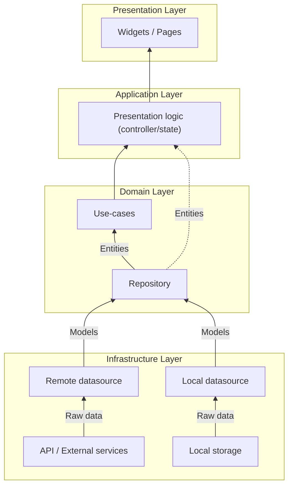

# Architecture

This page documents the current project architecture used by OpenPlant.

It is intentionally small: the goal is to demonstrate a repeatable structure (layers, wiring, testing seams) without pulling in app-specific concepts from the original repository this template came from.

## Folder Structure

All source code lives in `lib/` and tests live in `test/`.

At the top level, OpenPlant is split into:

- `lib/core/`: Cross-cutting code (settings persistence, theming, dependency wiring).
- `lib/pages/`: Feature modules. In this app they are `page1` to `page6` and serve as examples.
- `lib/widgets/`: Globally reusable widgets (buttons, search bar, etc.).
- `lib/l10n/`: Generated localization code.

Within each feature module (example: `lib/pages/page1/`) we follow a small layered structure:

- `*_datasource.dart`: Data access boundary (API, DB, platform, etc.).
- `*_repository.dart`: Domain-friendly access and mapping.
- `*_usecases.dart`: Orchestration and business rules.
- `*_entity.dart`: Immutable data models used by the UI.
- `*_page.dart`: UI.

As a simplified tree:

```text
├── assets
│   └── l10n
├── docs
│   └── wiki
├── lib
│   ├── core
│   │   ├── app_scope.dart
│   │   ├── injection.dart
│   │   ├── settings.dart
│   │   └── themes.dart
│   ├── l10n
│   ├── pages
│   │   ├── home
│   │   ├── page1
│   │   ├── ...
│   │   └── pageN
│   └── widgets
└── test
```

## Layered Architecture

OpenPlant uses a simple layered approach inspired by Clean Architecture. The exact naming is less important than the dependency direction:

- UI depends on use-cases.
- Use-cases depend on repositories.
- Repositories depend on datasources.
- Datasources talk to the outside world.



### Presentation Layer

The Presentation layer is made of Flutter widgets (pages and shared widgets). It renders the UI and routes user interactions to the underlying logic.

### Application Layer

The Application layer holds UI-facing state and orchestration that should not live directly in the widgets.

In this app:

- Feature pages use `StatefulWidget` for local UI state.
- Global app state is managed by `SettingsController` (a `ChangeNotifier`) and observed in `lib/main.dart`.

No BLoC pattern is used by this app.

### Domain Layer

The Domain layer is represented by entities, repositories, and use-cases:

- Entities are immutable data models used by the UI.
- Repositories abstract where data comes from and map raw data into domain entities.
- Use-cases provide an entry point for UI actions and orchestrate repository calls.

### Infrastructure Layer

The Infrastructure layer contains datasources. A datasource is the only place that should talk to external systems such as HTTP APIs, databases, or platform channels.

## Dependency Injection

OpenPlant uses GetIt as a service locator to keep object creation centralized and testable.

- DI container: `lib/core/injection.dart`
- Called from: `lib/main.dart`

`lib/core/injection.dart` registers:

- `SettingsController` (loaded from persistence at startup).
- Datasources, repositories, and use-cases per feature module.
- An `AppServices` aggregate used by the UI (`AppScope.of(context).services`).

The UI does not need to import GetIt directly: `AppScope` exposes `SettingsController` and `AppServices` down the widget tree.
